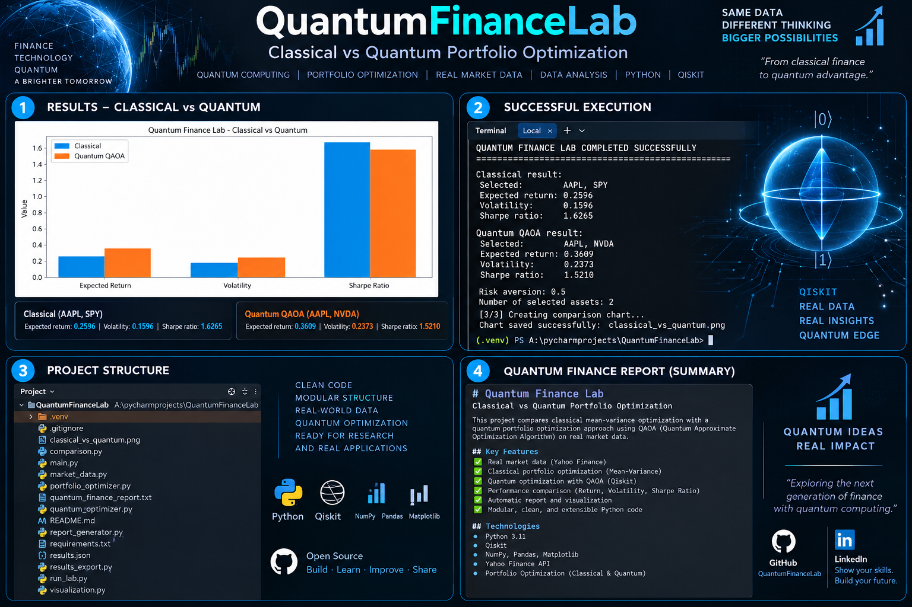

# Quantum Finance Lab

Hybrid quantum-classical finance research project built with Python and Qiskit.

The project explores how quantum computing algorithms can be combined with classical financial models, real market data and quantitative analysis.

## Project Overview

Quantum Finance Lab is an experimental research environment focused on applying quantum computing techniques to financial problems.

The system combines classical data processing with quantum algorithms to investigate portfolio optimization, market modelling and financial decision-support applications.

## Core Research Areas

### 1. Quantum Portfolio Optimization

- Portfolio construction
- Risk-return optimization
- Asset selection
- Covariance analysis
- Binary optimization
- QUBO formulation
- QAOA-based optimization

### 2. Variational Quantum Algorithms

Research and experimentation with hybrid quantum-classical algorithms including:

- QAOA
- VQE
- Parameterized quantum circuits
- Classical optimizers
- Quantum expectation values

### 3. Quantum Machine Learning

Exploration of quantum-enhanced machine learning techniques for financial applications:

- Quantum feature maps
- Variational quantum circuits
- Hybrid quantum-classical models
- Financial data classification
- Market pattern research

### 4. Financial Market Data

The classical layer processes real financial market information including:

- Historical prices
- Expected returns
- Volatility
- Correlations
- Covariance matrices
- Portfolio risk metrics

## Technology Stack

- Python
- Qiskit
- NumPy
- Pandas
- yfinance
- QAOA
- VQE
- QUBO
- Quantum Machine Learning
- Classical Optimization
- Financial Market Data

## Hybrid Architecture

Financial Market Data
↓
Python Data Processing
↓
Quantitative Analysis
↓
Optimization Problem
↓
Quantum Model
↓
Qiskit
↓
Quantum / Classical Optimization
↓
Financial Decision Support

## Project Visual

## Research Goal

The goal of Quantum Finance Lab is to investigate practical applications of quantum computing in finance and develop hybrid architectures where quantum algorithms complement classical financial analytics.

Research directions include:

- Quantum portfolio optimization
- QAOA benchmarking
- VQE experiments
- Quantum machine learning
- Risk optimization
- Financial forecasting research
- Quantum vs classical algorithm comparison
- Execution on real quantum hardware

## Current Development

The project is being developed as a modular research environment where different quantum algorithms and financial models can be tested independently and combined into larger workflows.

## Status

Active development and research project.

The current focus is hybrid quantum-classical financial optimization using Python, Qiskit and real financial market data.

## Disclaimer

This project is intended for research, experimentation and educational purposes. Outputs should not be considered financial advice.
